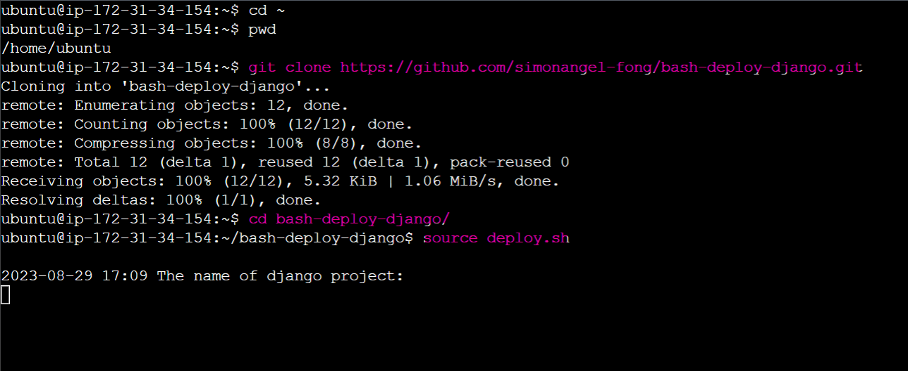
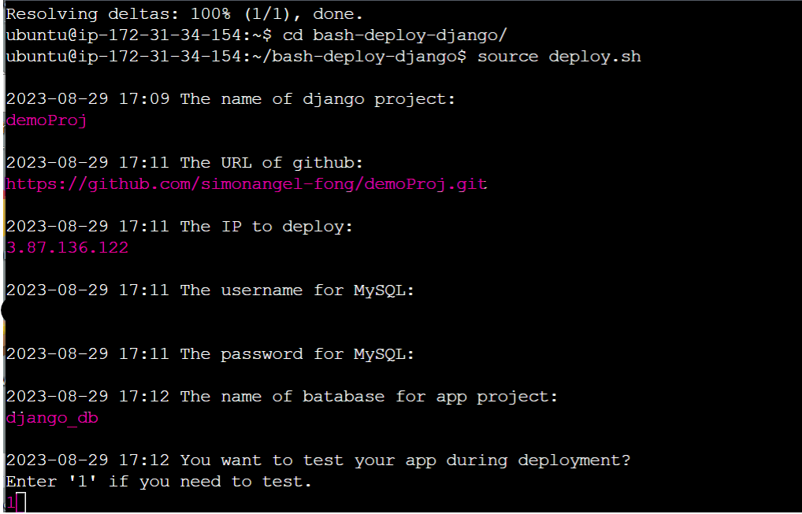
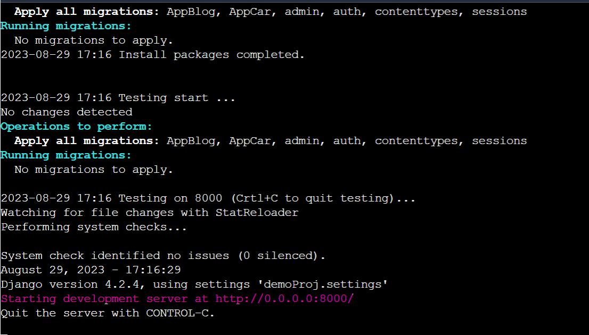
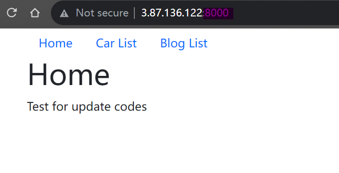
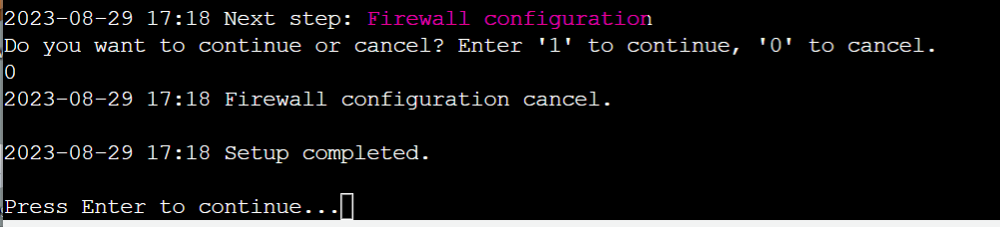
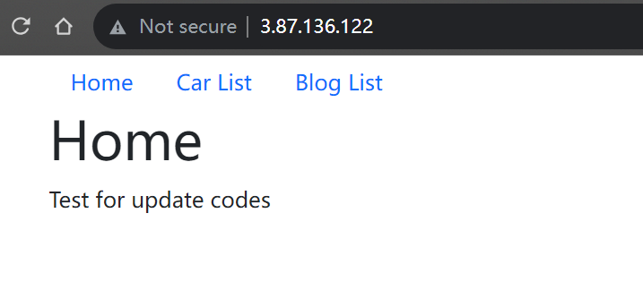
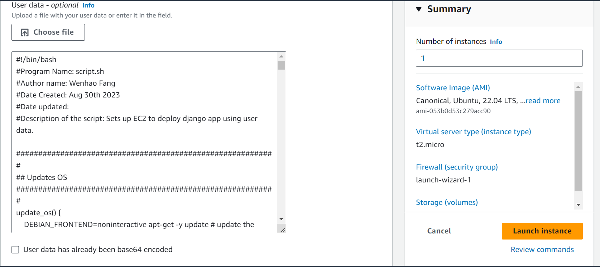

# Bash Deploy Django App

A project of bash script to deploy a django on an AWS EC2

- [Bash Deploy Django App](#bash-deploy-django-app)
  - [V 1.0.0](#v-100)
  - [V 1.0.1](#v-101)

---

## V 1.0.0

- 1. Deploy Django + Gunicorn + Supervisor on AWS EC2 manually.
- 2. Deploy Django project on AWS EC2 using Cloudshell+bash script.
- 3. Update code from github using bash script manually.

- **Example**

  - Deploy a demo django app using bash script. (Django proejct: https://github.com/simonangel-fong/demoProj.git)

1. Download and run script

   

2. Input project data

   

3. Testing app

   

   

4. Firewall configuration is optional

   

5. The final outcome:

    

---

## V 1.0.1

- 1. Deploy Django project on AWS EC2 using User Data.
- 2. Update code from github using a bash script that is automatically created when initializing EC2.

